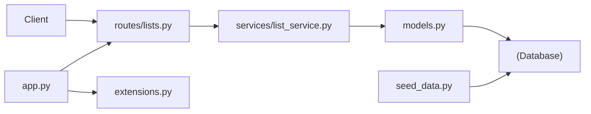
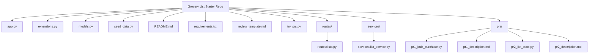

# GroceryList — AI201 Lab 6 Starter

A shared grocery list API where members create lists, add items, and track what's been purchased.

## What the app does

- **Lists** — users create named grocery lists (private or shared)
- **Items** — add items to a list with optional quantity, unit, and category
- **Purchasing** — mark individual items as purchased during a shopping trip

## How requests flow

The app follows a typical Flask pattern: routes handle HTTP, services hold business logic, and models talk to the database.



## Setup

```bash
python -m venv .venv
source .venv/bin/activate      # Mac/Linux
# or: .venv\Scripts\activate   # Windows

pip install -r requirements.txt

python seed_data.py    # populate the database
python app.py          # start the server (runs at http://127.0.0.1:5000)
```

The seed script prints user IDs and list IDs — save them. You'll use them throughout the lab.

## API

| Method | Endpoint                               | Description                        |
|--------|----------------------------------------|------------------------------------|
| GET    | `/lists/`                              | List all grocery lists             |
| POST   | `/lists/`                              | Create a new list                  |
| GET    | `/lists/<list_id>/items`               | Get items for a list               |
| POST   | `/lists/<list_id>/items`               | Add an item to a list              |
| PATCH  | `/lists/<list_id>/items/<item_id>`     | Mark an item as purchased          |

## Codebase structure

Four zones: app setup → models → routes/services → PR review files.



```plaintext
app.py                  Flask application factory
extensions.py           Shared Flask extensions (e.g. SQLAlchemy)
models.py               SQLAlchemy models: User, GroceryList, Item
routes/
  lists.py              All list and item routes
services/
  list_service.py       Business logic for lists and items
seed_data.py            Database seed script
try_prs.py              Test server that adds both PR endpoints alongside the base app
prs/
  pr1_description.md    PR #1 description (bulk purchase feature)
  pr1_bulk_purchase.py  PR #1 proposed code
  pr2_description.md    PR #2 description (list stats feature)
  pr2_list_stats.py     PR #2 proposed code
review_template.md      Template for your code review notes
```

## PR review workflow

This lab includes two proposed PRs under `prs/`. Read the description before inspecting the code — it states what the PR intends; the code shows what it actually changes.

1. Read `review_template.md`
2. Open each PR description under `prs/`
3. Inspect the matching `.py` file and compare against `routes/lists.py`, `services/list_service.py`, and `models.py`
4. Write your review notes in `review_template.md`

> **Project 6 (CineLog)** is a separate assignment — responding to review comments as a contributor, not reviewing others' PRs. See [`../cinelog-orientation.md`](../cinelog-orientation.md) for those workflow diagrams.

## Running example requests

```bash
# List all grocery lists
curl http://127.0.0.1:5000/lists/

# Get items for a list (replace LIST_ID with ID from seed output)
curl http://127.0.0.1:5000/lists/LIST_ID/items

# Add an item
curl -X POST http://127.0.0.1:5000/lists/LIST_ID/items \
  -H "Content-Type: application/json" \
  -d '{"name": "Eggs", "quantity": 12, "unit": "count", "category": "dairy", "added_by": "USER_ID"}'

# Mark an item as purchased
curl -X PATCH http://127.0.0.1:5000/lists/LIST_ID/items/ITEM_ID \
  -H "Content-Type: application/json" \
  -d '{"user_id": "USER_ID"}'
```

### Windows / PowerShell notes

The examples above use Mac/Linux shell syntax. On Windows:

- Use `curl.exe`, not `curl` — in PowerShell, `curl` is an alias for `Invoke-WebRequest`, which truncates the response output.
- Run each command as a **single line** — the trailing `\` line continuations above are Mac/Linux syntax and cause errors if pasted into PowerShell. Make sure to keep a space before each flag (` -H `, ` -d `) when joining lines.
- Escape the inner double quotes in JSON bodies with backslashes:

```powershell
curl.exe -X PATCH http://127.0.0.1:5000/lists/LIST_ID/items/ITEM_ID -H "Content-Type: application/json" -d '{\"user_id\": \"USER_ID\"}'
```

(Git Bash users can run the Mac/Linux commands as written.)
