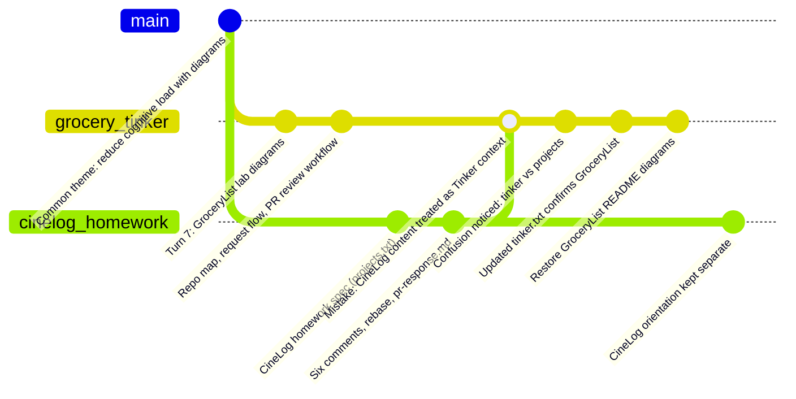
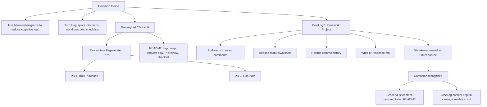

# Side story: how the diagram work got confused

Lecture notes for this repo. Documents a mix-up while adding load-reducing Mermaid diagrams in July 2026.

## What happened

Three related tracks shared one theme (use diagrams to lower cognitive load) but are **different assignments**:

| Track | Spec | Repo / doc | Your role |
|-------|------|------------|-----------|
| **GroceryList Tinker 6** | `tinker.txt` | `ai201-lab6-grocerylist-starter` (this repo) | Review two AI-generated PRs |
| **CineLog Project 6** | `projects.txt` | `ai201-project6-cinelog-starter` (homework) | Respond to six review comments as contributor |
| **Common theme** | — | Both | Mermaid maps, workflows, checklists |

**The mistake:** `tinker.txt` was briefly identical to `projects.txt` (CineLog homework pasted into both). Turn 8 in Copilot then treated the whole conversation as CineLog. Cursor added CineLog workflow diagrams to the wrong context, trimmed the GroceryList README, and created `cinelog-orientation.md`.

**The fix:** Updated `tinker.txt` confirms **Tinker 6 = GroceryList**. GroceryList diagrams were restored to this README. CineLog orientation stayed in `cinelog-orientation.md`. `projects.txt` remains the separate homework spec.

## Conceptual timeline (`gitGraph`)

*Not literal Git history — a memory aid for how ideas branched and reconverged.*

## Conceptual map (`flowchart`)

Clearer than `gitGraph` for *what belongs where*:

## What lives where (after separation)

### This repo (GroceryList lecture notes + lab)

- Request/data flow
- Repo structure
- Tinker milestone workflow
- PR description as contract
- AI-generated bug pattern mindmap
- PR review workflow
- PR files relationship
- Code review checklist mindmap
- Read less, understand more

### CineLog homework (`cinelog-orientation.md` in notes folder)

- Six review comments map
- `pr-response.md` structure mindmap
- Rebase / Git workflow
- Interactive rebase / commit cleanup

## Lesson

> Use **flowchart** to explain conceptual confusion. Use **gitGraph** only as a labeled “history of ideas,” not as literal repo history.

Source: Copilot turns 10–11, Cursor session correcting the mix-up.
