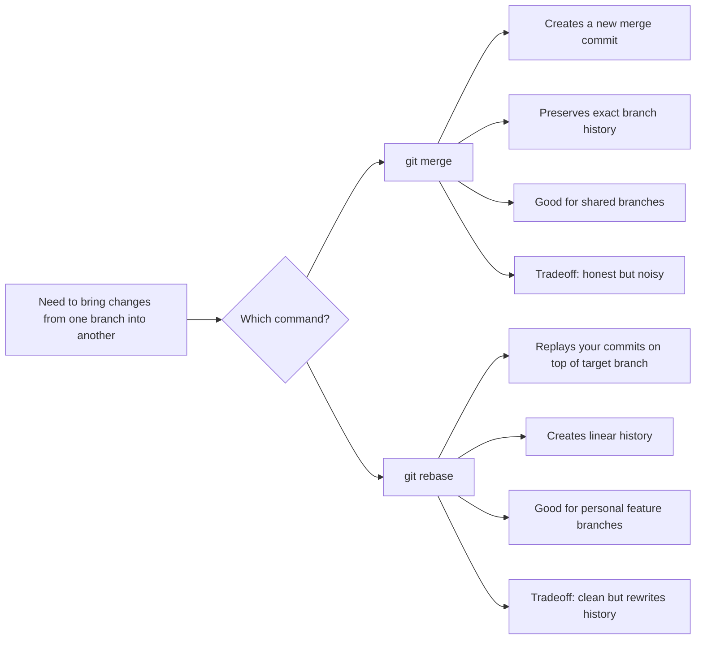
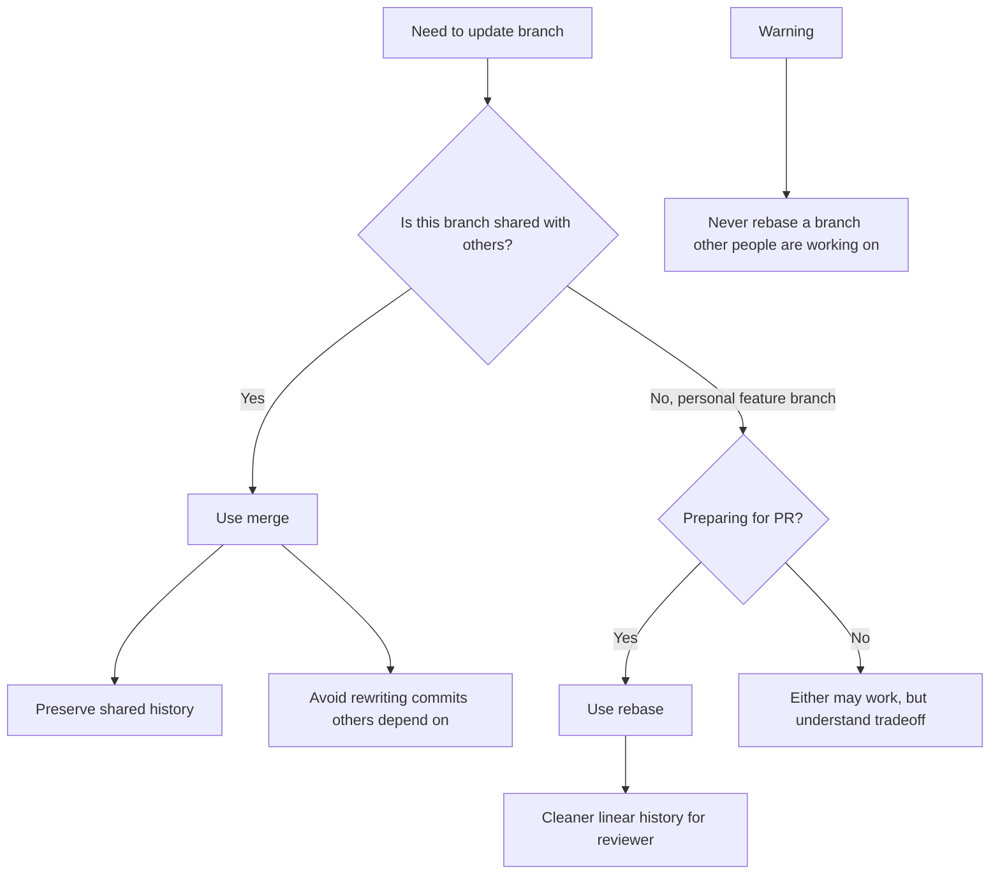
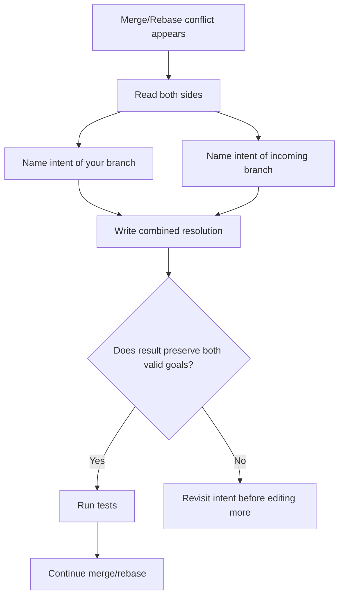
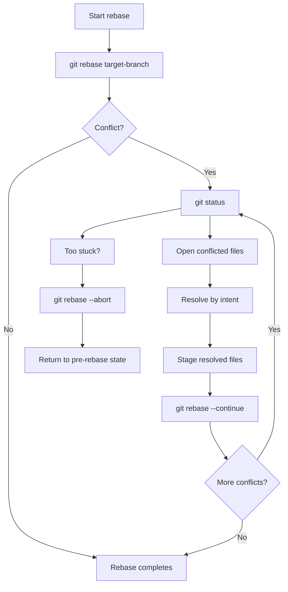
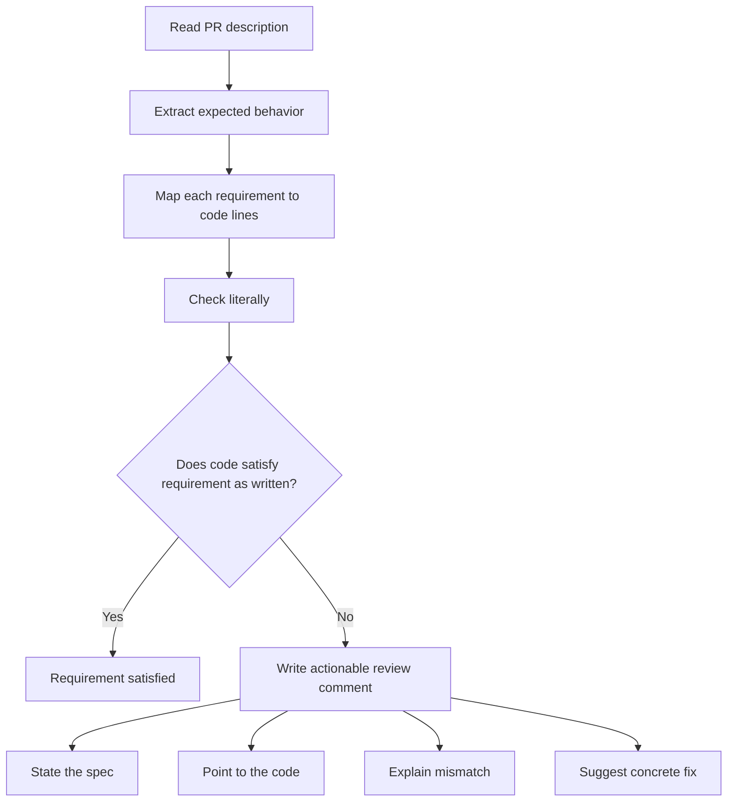
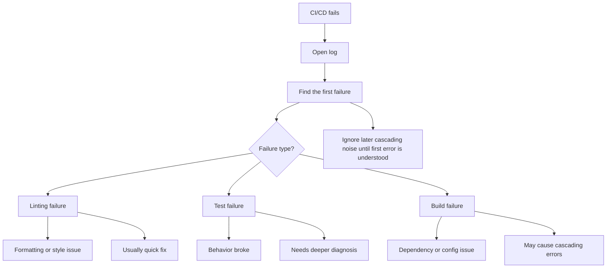
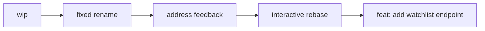
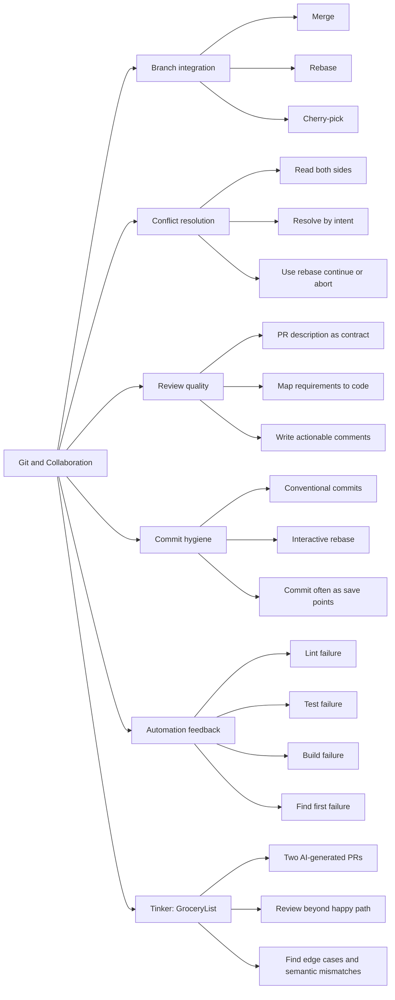
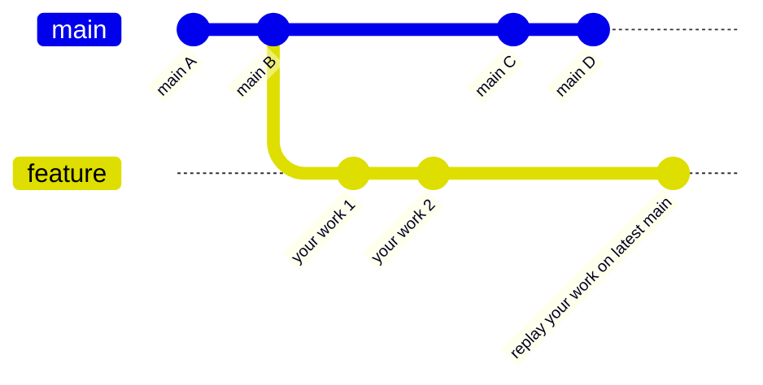

# Lecture notes — Module 2 Lesson 6: Git and Collaboration

AI201 Week 6 lecture companion for this repo. Source: **Su26 AI201 — Module 2 Lesson 6 — Git and Collaboration [S1c]** slide text, plus Mermaid diagrams from Copilot turn 12.

The lecture covers merge vs rebase, conflict resolution, code review, conventional commits, CI/CD logs, and connects to the **GroceryList Tinker** activity in this repo. The **CineLog** homework project applies the same Git/review skills separately.

## Lecture arc (from slides)

| Segment | Topic |
|---------|--------|
| Git fundamentals | Merge vs rebase, history shapes, rule of thumb |
| Conflicts | Markers, wrong approach, resolve by intent |
| Commands | `git rebase`, `git status`, `--continue`, `--abort` |
| Review | PR description as contract |
| Hygiene | Conventional commits, interactive rebase, commit often |
| Automation | CI/CD — find the **first** failure |
| Tinker | GroceryList — review two AI-generated PRs |
| Project preview | CineLog — six comments, rebase, rewrite history |

---

## Mermaid diagrams

### 1. Merge vs rebase concept map

Both integrate changes from one branch into another; they differ in **how** and in **history shape**.



### 2. Rule of thumb — merge or rebase?



### 3. Conflict resolution by intent

Do not pick whichever side looks newer. Name each side's goal, then combine.



### 4. Rebase command flow



### 5. Code review as contract

Matches the lecture's three steps and the tinker lab mindset.



### 6. CI/CD output debugging



### 7. Interactive rebase mental model

`git rebase <branch>` updates where your branch starts. `git rebase -i HEAD~N` rewrites commit messages and structure.



### 8. Master lecture map



### 9. Slide 12 — rebase before PR (conceptual `gitGraph`)

*Illustrates why rebase replays your work on latest `main` before opening a PR.*



---

## Multiple-choice slides (detailed)

### Slide 12 — merge or rebase before PR?

**Question:** Feature branch open two weeks. Main moved ahead 30 commits. About to open a PR. Merge main in or rebase onto main?

| Option | Verdict |
|--------|---------|
| A. Merge | Works, but adds a noisy merge commit the reviewer must filter out |
| **B. Rebase** | **Correct** — personal feature branch, clean linear history for review |
| C. Depends | Often true in Git, but this scenario matches the rebase-before-PR rule |

### Slide 22 — 15 commits behind main, want clean history

**Question:** Feature branch 15 commits behind main. Want clean, linear history for reviewer.

| Option | Verdict |
|--------|---------|
| A. Merge main in | Defeats linear-history goal (merge commit) |
| **B. Rebase onto main** | **Correct** — `git fetch origin` then `git rebase origin/main` |
| C. Cherry-pick from main | Wrong tool — cherry-pick grabs one commit, not full sync |
| D. Open PR as-is | Pushes hygiene work onto reviewer |

### Slide 23 — conflict: null check vs rename

**Question:** Your branch added a null check before a call. Incoming branch renamed the function. Resolved version?

| Option | Verdict |
|--------|---------|
| A. Keep null check, old name | Preserves your intent, deletes rename |
| B. Keep rename, drop null check | Preserves rename, deletes safety |
| **C. Null check on renamed function** | **Correct** — preserve both intents |
| D. Rewrite from scratch | Nuclear option; both changes are compatible here |

**Example resolution:**

```python
if value is not None:
    renamed_function(value)
```

---

## Quick reference (from slides)

### Merge vs rebase

```text
merge  = preserves actual branch history
rebase = replays your commits onto a new base
```

### Conflict markers

```text
<<<<<<< HEAD          your branch
=======
>>>>>>> branch-name   incoming branch
```

### Conventional commit prefixes

```text
feat:   new feature
fix:    bug fix
chore:  maintenance, deps, config
docs:   documentation only
test:   adding or updating tests
```

### Commit often (especially with AI agents)

A commit is a **save point**. Small commits are easier to review, bisect, and revert. When an agent breaks a working state, `git reset --hard` to a known-good commit beats asking the agent to unwind its own mess.

### Cherry-pick (narrow tool)

`git cherry-pick <hash>` applies **one** commit from another branch. Use for hotfixes or borrowing a single change — not for syncing your whole branch with `main`.

---

## Related notes in this repo

- [`README.md`](README.md) — lab setup, API, tinker-specific review diagrams
- [`diagram-confusion-side-story.md`](diagram-confusion-side-story.md) — how GroceryList vs CineLog diagram work got mixed up
