# Lecture notes — Module 2 Lesson 6: Git and Collaboration

AI201 Week 6 lecture companion for this repo. Source: **Su26 AI201 — Module 2 Lesson 6 — Git and Collaboration [S1c]** slide text, plus Mermaid diagrams from Copilot turns 12 and 20–21.

The lecture covers merge vs rebase, conflict resolution, code review, conventional commits, CI/CD logs, and connects to the **GroceryList Tinker** activity in this repo. The **CineLog** homework project applies the same Git/review skills separately.

A recurring confusion in this lecture is **which layer you are on**: core Git commands, branch workflow, hosting platform (GitHub/GitLab/Gerrit), or review/history hygiene (PRs, rebase). The five-level model below is a zoom-in / zoom-out tour from beginner commands to internals.

## Lecture arc (from slides)

| Segment | Topic |
|---------|--------|
| Git fundamentals | Merge vs rebase, history shapes, rule of thumb |
| Conflicts | Markers, wrong approach, resolve by intent |
| Commands | `git rebase`, `git status`, `--continue`, `--abort` |
| Review | PR description as contract |
| Hygiene | Conventional commits, interactive rebase, commit often |
| Automation | CI/CD — find the **first** failure |
| Tinker | GroceryList — review two AI-generated PRs |
| Project preview | CineLog — six comments, rebase, rewrite history |

---

## Five-level Git mental model

Zoom **out**: Git is a save-point tool. Zoom **in**: Git is a commit graph plus movable labels (refs, HEAD).

| Level | What you see | Examples |
|-------|----------------|----------|
| 1 — Survival commands | What do I type? | `git status`, `add`, `commit`, `push`, `pull`, `log` |
| 2 — Branches | Where is my work? | `main`, feature branch, `HEAD` |
| 3 — Remotes and platforms | Where does code live? | `origin`, GitHub, GitLab, Gerrit, AOSP Repo |
| 4 — Collaboration hygiene | How do teams integrate? | PRs, reviews, rebase, conventional commits |
| 5 — Internals | What Git actually stores | Commits, refs, trees/blobs, diff algorithms |

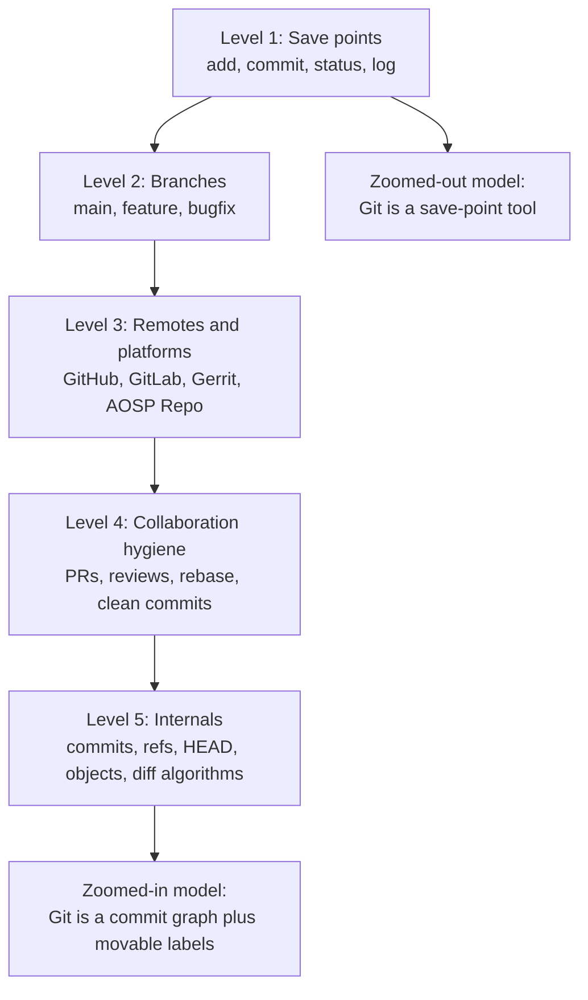

### Git vs platform layer

**Pull requests are not native to core Git.** They are a platform-level collaboration feature (GitHub calls it a pull request; GitLab a merge request; Gerrit/AOSP a change or changelist).

```text
Core Git:     commit, branch, merge, rebase, push, fetch, pull, diff
GitHub adds:  pull request, review comments, checks, branch protection, web diff UI
AOSP Repo:    wrapper over many Git repos; uploads to Gerrit (does not replace Git)
```

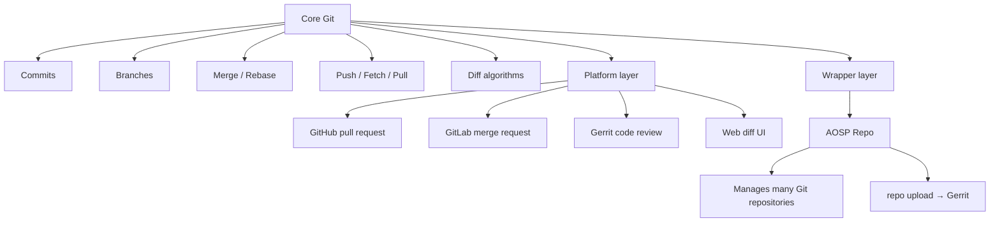

**AOSP Repo** canonical source is on `googlesource.com`; there is also a [GitHub mirror](https://github.com/GerritCodeReview/git-repo). Repo does not replace Git — it orchestrates many repos and uploads to Gerrit.

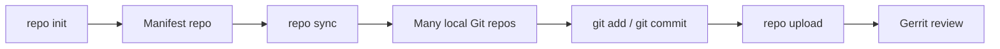

### Public timeline (iPhone, GitHub, AOSP)

If the question is "which came first publicly":

```text
2007 Jan/Jun — iPhone announced and released
2008 Apr     — GitHub public launch
2008 Oct     — Android source released as AOSP
```

Many engineers encounter AOSP Repo and Gerrit before GitHub; that personal path is normal. The layers above still apply.

### Web diff vs local `git diff`

Platform web diffs (GitHub, Gerrit, GitLab) are **rendered views**, not guaranteed to match every local option. Core Git supports multiple diff algorithms: `myers` (default), `minimal`, `patience`, `histogram`.

If a web diff looks confusing, try locally:

```bash
git diff --patience main...your-branch
git diff --histogram main...your-branch
```

Sometimes a different algorithm makes a refactor much easier to read.

---

## Mermaid diagrams

### 1. Merge vs rebase concept map

Both integrate changes from one branch into another; they differ in **how** and in **history shape**.

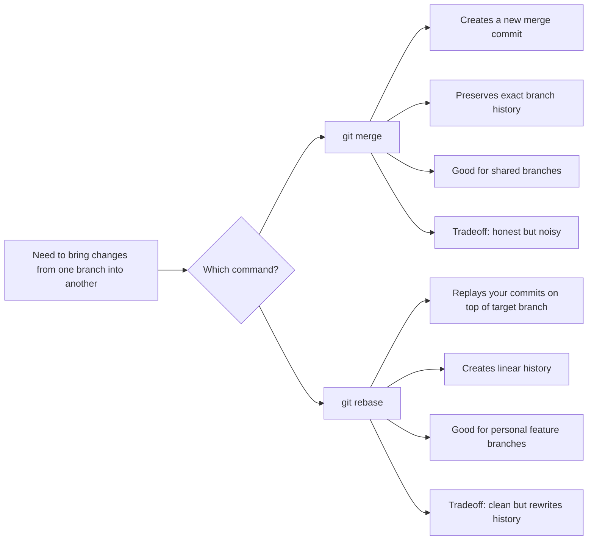

### 2. Rule of thumb — merge or rebase?

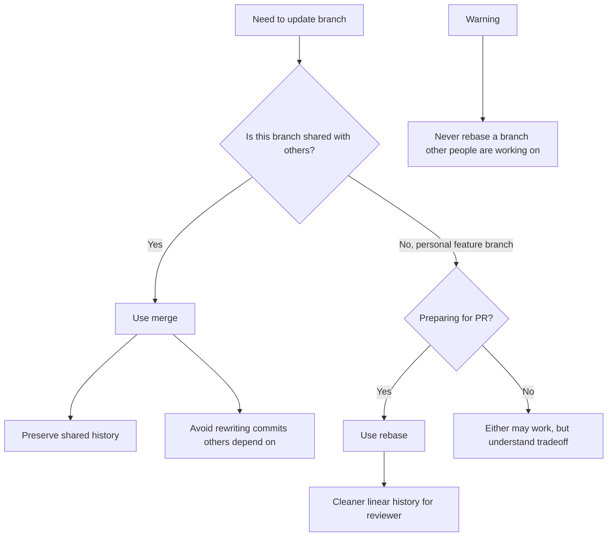

### 3. Conflict resolution by intent

Do not pick whichever side looks newer. Name each side's goal, then combine.

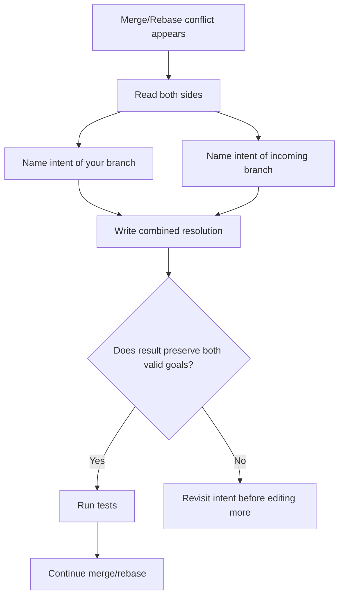

### 4. Rebase command flow

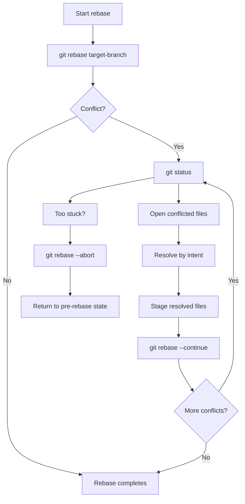

### 5. Code review as contract

Matches the lecture's three steps and the tinker lab mindset.

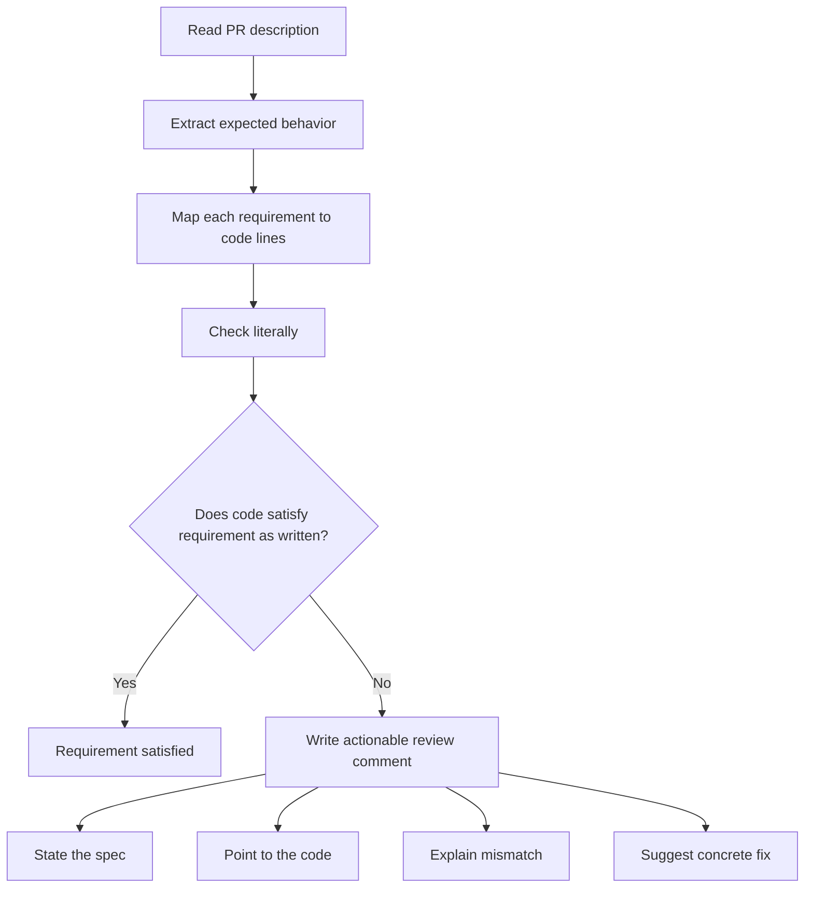

### 6. CI/CD output debugging

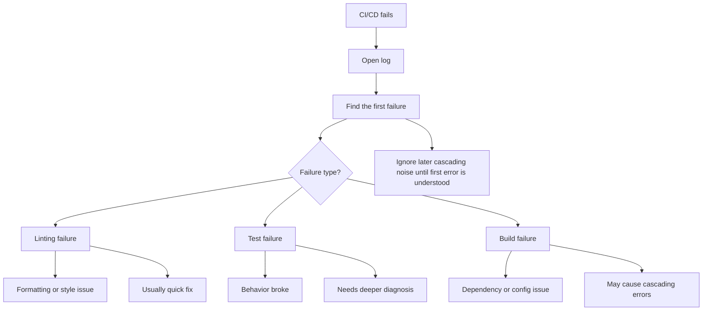

### 7. Interactive rebase mental model

`git rebase <branch>` updates where your branch starts. `git rebase -i HEAD~N` rewrites commit messages and structure.

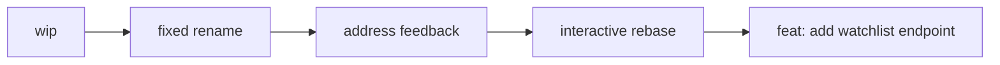

### 8. Master lecture map

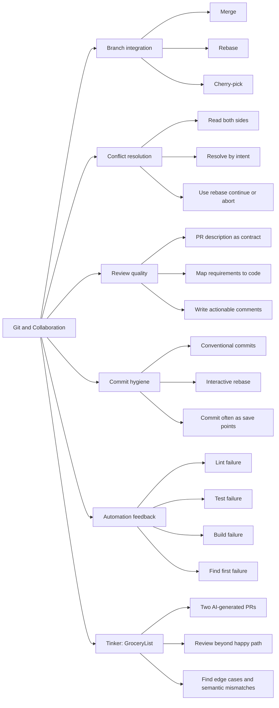

### 9. Slide 12 — rebase before PR (conceptual `gitGraph`)

*Illustrates why rebase replays your work on latest `main` before opening a PR.*

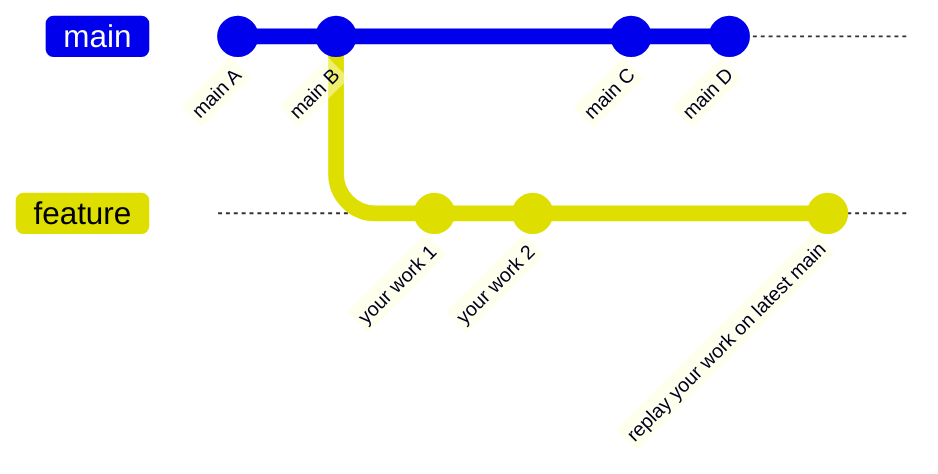

---

## Multiple-choice slides (detailed)

Git MCQs are rarely about memorizing commands. They test whether you pick the command that matches the **collaboration context** (personal vs shared branch, full sync vs one commit, conflict intents).

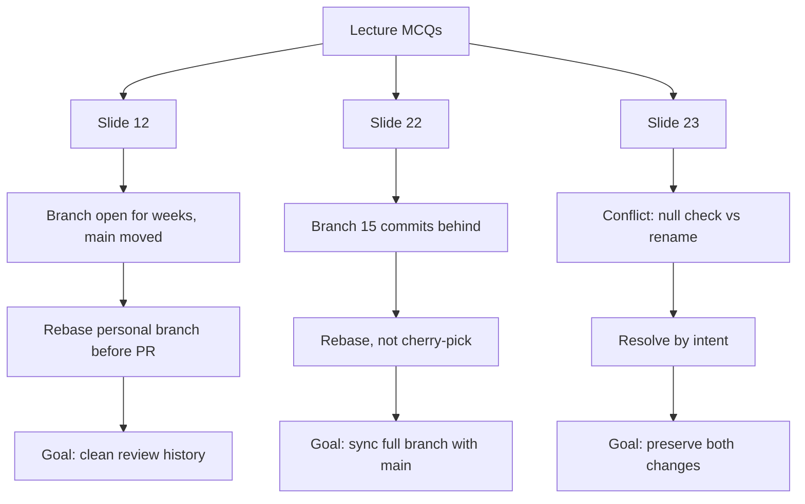

### Slide 12 — merge or rebase before PR?

**Question:** Feature branch open two weeks. Main moved ahead 30 commits. About to open a PR. Merge main in or rebase onto main?

| Option | Verdict |
|--------|---------|
| A. Merge | Works, but adds a noisy merge commit the reviewer must filter out |
| **B. Rebase** | **Correct** — personal feature branch, clean linear history for review |
| C. Depends | Often true in Git, but this scenario matches the rebase-before-PR rule |

**Concrete setup:**

```text
main:        A---B---C---D---E
your branch: A---B---x---y
```

While you worked on `x` and `y`, main moved to `E`.

**Before updating** — feature is behind main:

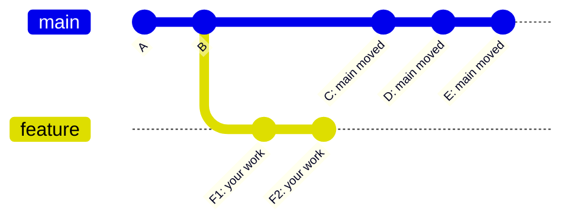

**If you merge main into feature** — valid, but noisy:

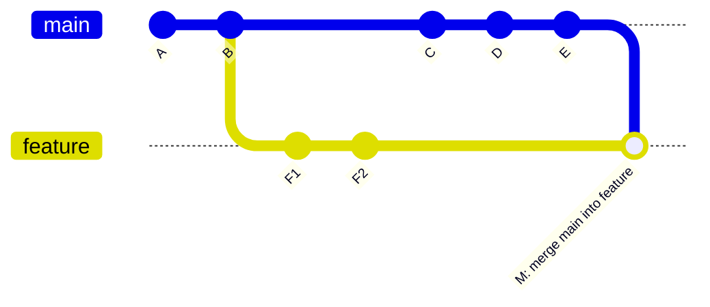

**If you rebase onto main** — cleaner for reviewers:

```bash
git rebase origin/main
```

```text
main after rebase view:  A---B---C---D---E---x'---y'
```

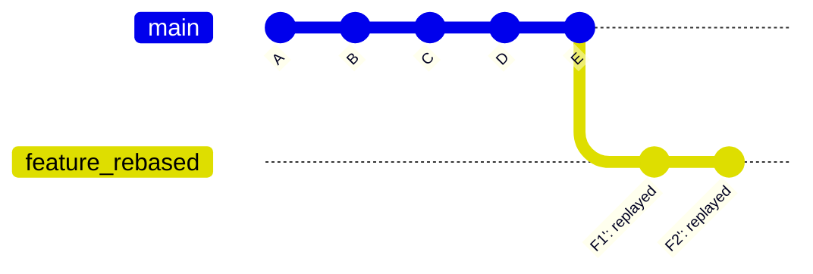

Reviewers only review your two commits on top of current main.

### Slide 22 — 15 commits behind main, want clean history

**Question:** Feature branch 15 commits behind main. Want clean, linear history for reviewer.

| Option | Verdict |
|--------|---------|
| A. Merge main in | Defeats linear-history goal (merge commit) |
| **B. Rebase onto main** | **Correct** — `git fetch origin` then `git rebase origin/main` |
| C. Cherry-pick from main | Wrong tool — cherry-pick grabs one commit, not full sync |
| D. Open PR as-is | Pushes hygiene work onto reviewer |

**Workflow example** on `bugfix/mixtape` when GitHub shows "15 commits behind main":

```bash
git fetch origin
git rebase origin/main
pytest tests/ -v          # verify after replay
git push --force-with-lease # only if branch was already pushed (rebase rewrites hashes)
```

**Before rebase** — your fixes sit on an old base while main moved:

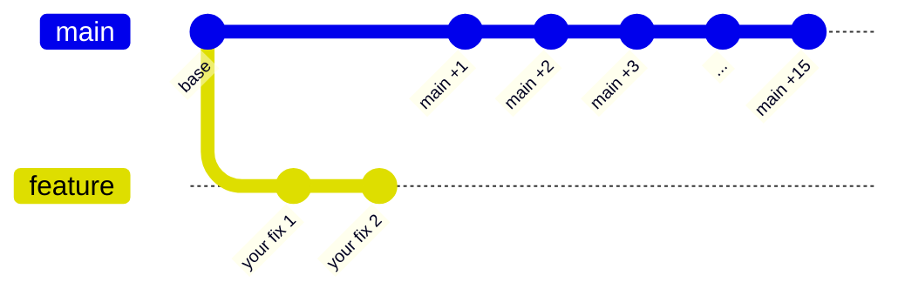

**After rebase** — linear history for the reviewer:

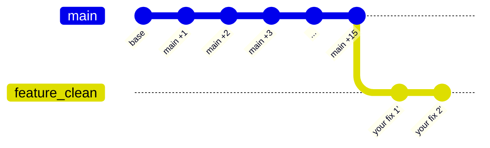

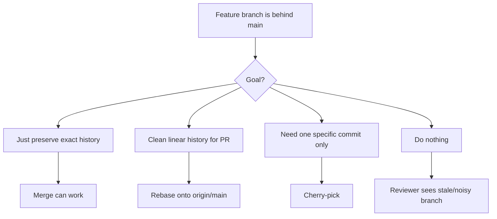

```text
Cherry-pick = grab one specific commit
Rebase      = update your whole branch base
```

### Slide 23 — conflict: null check vs rename

**Question:** Your branch added a null check before a call. Incoming branch renamed the function. Resolved version?

| Option | Verdict |
|--------|---------|
| A. Keep null check, old name | Preserves your intent, deletes rename |
| B. Keep rename, drop null check | Preserves rename, deletes safety |
| **C. Null check on renamed function** | **Correct** — preserve both intents |
| D. Rewrite from scratch | Nuclear option; both changes are compatible here |

**Branch history** — both sides edited the same call site:

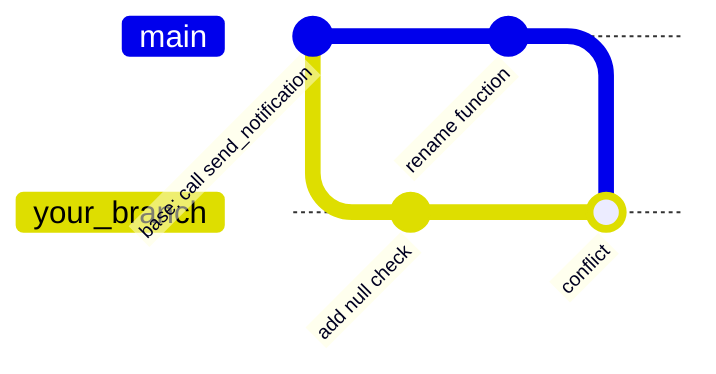

**Your branch:**

```python
if user is not None:
    send_notification(user)
```

**Incoming branch:**

```python
deliver_notification(user)
```

**Correct resolution** — preserve both intents (safety + clearer API name):

```python
if user is not None:
    deliver_notification(user)
```

```mermaid
flowchart TD
    A[Conflict in same code block] --> B[Your branch]
    A --> C[Incoming branch]
    B --> B1[Added null check]
    B1 --> B2[Intent: safety]
    C --> C1[Renamed function]
    C1 --> C2[Intent: clearer or new API]
    B2 --> D[Correct resolution]
    C2 --> D
    D --> E[Keep null check]
    D --> F[Use renamed function]
```

Do not ask "which side wins?" Ask "what were both sides trying to accomplish?"

---

## Quick reference (from slides)

### Merge vs rebase

```text
merge  = preserves actual branch history
rebase = replays your commits onto a new base
```

### Conflict markers

```text
<<<<<<< HEAD          your branch
=======
>>>>>>> branch-name   incoming branch
```

### Conventional commit prefixes

```text
feat:   new feature
fix:    bug fix
chore:  maintenance, deps, config
docs:   documentation only
test:   adding or updating tests
```

### Commit often (especially with AI agents)

A commit is a **save point**. Small commits are easier to review, bisect, and revert. When an agent breaks a working state, `git reset --hard` to a known-good commit beats asking the agent to unwind its own mess.

### Cherry-pick (narrow tool)

`git cherry-pick <hash>` applies **one** commit from another branch. Use for hotfixes or borrowing a single change — not for syncing your whole branch with `main`.

---

## Related notes in this repo

- [`README.md`](README.md) — lab setup, API, tinker-specific review diagrams
- [`diagram-confusion-side-story.md`](diagram-confusion-side-story.md) — how GroceryList vs CineLog diagram work got mixed up
