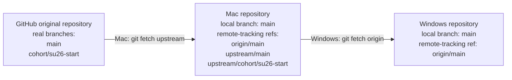
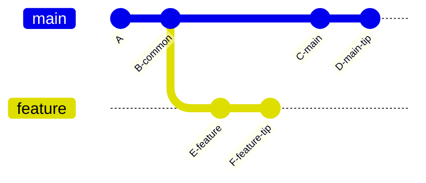
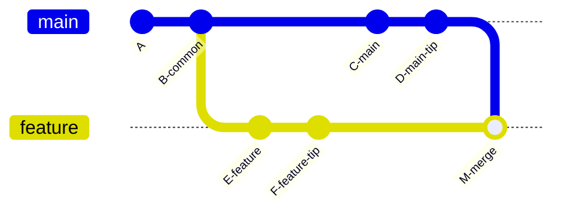
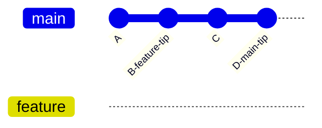
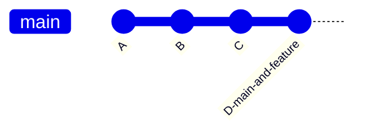
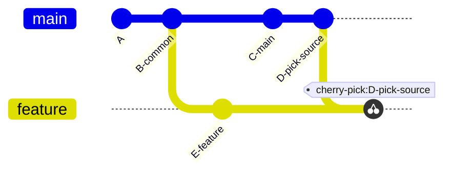
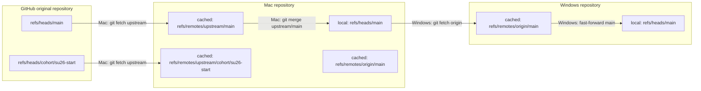
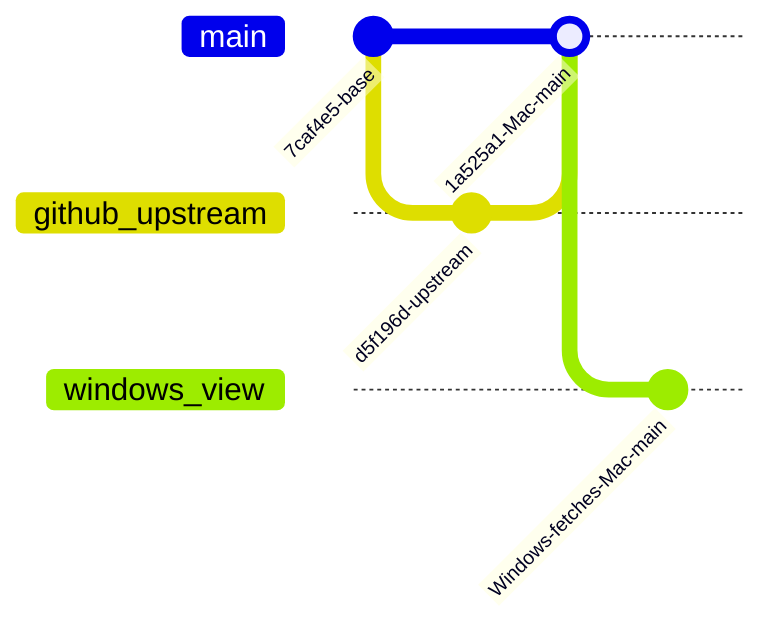

# Git remotes, merge diagrams, and CMake isolation

Study note extracted from M365 Copilot dialogue turn `t-1784586181891`
(`dlg-m365-cd4710c5`), related to AI201 Module 3 Week 7 PathReview setup
(git upstream sync, remotes across machines, and build isolation analogies).

**Source:** `chat/codepath/ai201/llm/docs/dialogue-dlg-m365-cd4710c5-8turns-git-remote-etc.json`  
**Recorded:** 2026-07-20T22:23:01+00:00  
**Interactive board:** `?board=git-build-remotes` on the grocerylist-hosted status page

---

## Question

is there something similar to venv for make/cmake?
and since we troubleshot the mermaid diagram several times, there was never a complete sequence without errors of the related mermaid gitgraphs, can you summarize and list them for me again with correct mermaid syntax?

1. Does git merge trace back through the diverging history?
Merge versus cherry-pick
Fast-forward is the simpler case ... etc

additional, can you also try to illustrate this in gitgraph aesthetics?
3. Your “upper-level entity containing branches” metaphor
Yes, that is a reasonable mental model, with one qualification.
You can picture:
In Git terminology, however, upstream is a remote configuration name, not literally a directory. It identifies information such as a URL and fetch rules:
After fetching, your clone creates local remote-tracking references:
These names even resemble paths internally, so your directory/tree metaphor is useful:
refs/
├── heads/
│   └── main
└── remotes/
    ├── origin/
    │   └── main
    └── upstream/
        ├── main
        └── cohort/su26-start

and can this be combine with the concept of another remote of the remote:

---
and can you also follow the attached example and give me another json of your summarization/explanation and a suitable name to be wired into boards.json?

---

## Answer

## 1. Is there something like `venv` for Make/CMake?
There is **no single exact equivalent**, because the tools isolate different things:
* Python `venv` isolates the Python interpreter environment and installed packages.
* `make` executes build rules; it does not manage an environment.
* CMake configures a build and generates files for another build system.
### Closest everyday equivalent: an out-of-source build directory
```bash
cmake -S . -B build/debug -DCMAKE_BUILD_TYPE=Debug
cmake --build build/debug
ctest --test-dir build/debug
```
Everything generated by CMake stays under `build/debug/`. To reset the build environment:
```bash
rm -rf build/debug
```
You can keep multiple independent configurations:
```text
project/
├── CMakeLists.txt
├── src/
├── build/
│   ├── debug/
│   ├── release/
│   ├── gcc/
│   └── clang/
```
For example:
```bash
cmake -S . -B build/release -DCMAKE_BUILD_TYPE=Release
cmake --build build/release
```
### For stronger environment isolation
Use these in combination:
* **CMake Presets** — records repeatable configure/build settings.
* **CMake toolchain files** — selects compilers, SDKs, target platforms, and related settings.
* **Conan or vcpkg** — manages C/C++ dependencies.
* **Docker/Podman, Nix, or a dev container** — isolates compilers, system libraries, and command-line tools.
* **Environment Modules** — commonly used on research clusters to select compiler and library stacks.
A good analogy is:
```text
Python venv
    ≈
out-of-source build directory
+ CMake preset
+ dependency manager
+ pinned compiler/toolchain
```
A preset-based workflow might be:
```bash
cmake --preset debug
cmake --build --preset debug
ctest --preset debug
```
***
# 2. Correct Mermaid sequence: merge, fast-forward, and cherry-pick
The earlier errors came from two important Mermaid rules:
1. A `gitGraph` starts with `main`; do **not** use `branch main`.
2. `branch feature` both creates **and switches to** the new branch. Therefore, use explicit `checkout` statements before subsequent commits. [\[mermaid.ai\]](https://mermaid.ai/open-source/syntax/gitgraph.html), [\[github.com\]](https://github.com/mermaid-js/mermaid/blob/develop/docs/syntax/gitgraph.md)
The space in `id: "D"` was **not** the problem. That is valid official syntax. The actual problem was incorrectly tracking which branch was active. [\[mermaid.ai\]](https://mermaid.ai/open-source/syntax/gitgraph.html), [\[emersonbot....github.io\]](https://emersonbottero.github.io/mermaid-docs/syntax/gitGraph.html)
## A. Diverging history before a merge

Conceptually:
```text
A──B──C──D              main
    \
     E──F               feature
```
Notice the ordering:
1. `A` and `B` are added to the default `main`.
2. `branch feature` creates **and checks out** `feature`.
3. `E` and `F` are therefore on `feature`.
4. `checkout main` returns to `main`.
5. `C` and `D` are added to `main`.
This ordering avoids depending on ambiguous assumptions about whether branch creation changes the active branch.
***
## B. Does `git merge` trace through the diverging history?
**Yes.** A normal three-way merge considers the histories reachable from both tips.
If you run:
```bash
git switch feature
git merge main
```
Git conceptually:
1. Reads current `feature` tip `F`.
2. Reads `main` tip `D`.
3. Finds their best common ancestor, `B`.
4. Evaluates changes from `B` to `F`.
5. Evaluates changes from `B` to `D`.
6. Combines the two sides.
7. Records the result as merge commit `M` when a true merge is needed.
Correct Mermaid:

Conceptually:
```text
A──B──C──D────────┐     main
    \              \
     E──F──────────M     feature
```
`M` has two parents:
* the previous `feature` tip, `F`;
* the merged `main` tip, `D`.
You can find the common ancestor in a real repository with:
```bash
git merge-base feature main
```
And inspect the complete relationship with:
```bash
git log --graph --decorate --oneline --all
```
***
## C. Fast-forward merge
Fast-forward is the simpler case. Suppose `feature` still points to `B`, while `main` has advanced to `D`.
### Before

Conceptually:
```text
A──B──C──D     main
   ^
 feature
```
If you then run:
```bash
git switch feature
git merge --ff-only main
```
Git does not have to combine two sets of changes. Because `B` is already an ancestor of `D`, Git only moves the `feature` reference from `B` to `D`.
### Result

Conceptually:
```text
A──B──C──D     main, feature
```
Mermaid `gitGraph` cannot precisely attach arbitrary Git reference labels to one commit, so `"D-main-and-feature"` is an explanatory label rather than a literal commit message.
The essential distinction is:
```text
Three-way merge:
combine changes and normally create a two-parent commit
Fast-forward:
move one branch reference to an existing descendant commit
```
***
## D. Correct cherry-pick diagram
This version follows Mermaid’s documented structure: the source commit exists on another branch before `cherry-pick` refers to it. [\[mermaid.ai\]](https://mermaid.ai/open-source/syntax/gitgraph.html), [\[docs.merma...viewer.com\]](https://docs.mermaidviewer.com/diagrams/git.html)

Conceptually:
```text
A──B──C──D-pick-source             main
    \
     E──cherry-pick:D-pick-source feature
```
The important state sequence is:
```text
A                    main
B-common             main
branch feature       create and switch to feature
E-feature            feature
checkout main        switch to main
C-main               main
D-pick-source        main
checkout feature     switch to feature
cherry-pick D        feature
```
The cherry-picked result is a **new commit**. It applies the change introduced by `D-pick-source`, but it does not acquire all of `main`’s history as its ancestry.
### Merge versus cherry-pick
```text
git merge main
```
* finds a merge base;
* examines the diverging histories;
* integrates the changes reachable from `main`;
* preserves the historical relationship.
```text
git cherry-pick <commit>
```
* selects one commit;
* computes the change introduced relative to its parent;
* reapplies that change to the current branch;
* creates a new commit identity.
This corrected sequence replaces the invalid diagrams preserved in the earlier dialogue export. [\[unmm-my.sh...epoint.com\]](https://unmm-my.sharepoint.com/personal/tallpik3_unm_edu/Documents/Microsoft%20Copilot%20Chat%20Files/dialogue-dlg-m365-cd4710c5-6turns_gitGraph-set-for-merge-ff-cp.json)
***
# 3. Your “upper-level entity containing branches” metaphor
Your metaphor is useful:
```text
upstream
├── main
└── cohort/su26-start
```
The qualification is that `upstream` is not literally a directory. It is a **locally chosen remote configuration name** containing information such as:
* a repository URL;
* fetch rules, called refspecs;
* optional push configuration.
You can inspect it with:
```bash
git remote get-url upstream
git config --get-all remote.upstream.fetch
```
After fetching, the clone stores remote-tracking references:
```text
refs/
├── heads/
│   └── main
└── remotes/
    ├── origin/
    │   └── main
    └── upstream/
        ├── main
        └── cohort/su26-start
```
The distinction is:
```text
refs/heads/main
```
is an actual local branch in this repository.
```text
refs/remotes/upstream/main
```
is this repository’s last-fetched observation of the remote’s `main`.
It is not a live connection and is not updated until another fetch occurs.
***
# 4. Can a remote repository itself have another remote?
Yes. A Git repository on the Mac can have its own `upstream`, while Windows calls that Mac repository `origin`.
However, remote configuration is **not inherited recursively**.
## Accurate repository/ref flowchart

The crucial behavior is:
```text
GitHub refs/heads/main
    ↓ Mac fetches
Mac refs/remotes/upstream/main
    ↓ Mac merges
Mac refs/heads/main
    ↓ Windows fetches the Mac
Windows refs/remotes/origin/main
    ↓ Windows merges or fast-forwards
Windows refs/heads/main
```
What does **not** normally happen:
```text
Mac refs/remotes/upstream/main
    ↓ automatically exported
Windows refs/remotes/origin/upstream/main
```
Windows asks the Mac repository for branches it advertises under `refs/heads/*`. It does not normally copy the Mac repository’s `refs/remotes/*` bookkeeping.
That is why:
```bash
git ls-remote --heads origin
```
showed only:
```text
refs/heads/main
```
The Mac had only one actual local branch, even though it also had several remote-tracking references. This matches the repository state documented in your attached dialogue. [\[unmm-my.sh...epoint.com\]](https://unmm-my.sharepoint.com/personal/tallpik3_unm_edu/Documents/Microsoft%20Copilot%20Chat%20Files/dialogue-dlg-m365-cd4710c5-6turns_gitGraph-set-for-merge-ff-cp.json)
***
## The same idea in `gitGraph` aesthetics
This is visually useful, but it is only an **analogy** because `gitGraph` lanes normally represent branches, not separate repositories.

Read it as:
1. GitHub has an upstream commit.
2. The Mac integrates that commit into its local `main`.
3. Windows can then learn the resulting history by fetching the Mac’s `main`.
Use the **flowchart** when exact repository ownership matters. Use the **gitGraph** when you primarily want commit-history aesthetics.
***
# 5. Generated JSON board files

> Note: the original Copilot download links below are ephemeral Teams object URLs. The durable copies live under the status board `docs/status/data/` (`workstream.git-build-remotes.json`).
I created a new learning-capsule board named:
```text
workstream.git-build-remotes.json
```
Its board entry is:
```json
{
  "id": "git-build-remotes",
  "file": "workstream.git-build-remotes.json",
  "label": "Git, Remotes & CMake Isolation"
}
```
It contains:
* Make/CMake environment-isolation guidance;
* diverging-history and merge diagrams;
* before/after fast-forward diagrams;
* corrected cherry-pick syntax;
* the remote/reference namespace explanation;
* the GitHub → Mac → Windows flowchart;
* a conceptual gitGraph-style repository-chain view.
Download it here:
[Download the Git, Remotes & CMake Isolation board](https://us-prod.asyncgw.teams.microsoft.com/v1/objects/0-eus-d15-c211da42a9b156ca14cd6d849b73f1e7/views/original/workstream.git-build-remotes.json)
I also created an updated copy of `boards.json` with the new entry appended while preserving your existing four entries:
[Download the updated boards.json](https://us-prod.asyncgw.teams.microsoft.com/v1/objects/0-eus-d20-5e558244ca1730a26f6410c043d91395/views/original/boards.updated.json)
To install them in the expected data directory, the final filenames should be:
```text
workstream.git-build-remotes.json
boards.json
```
Since the downloaded registry is named `boards.updated.json`, either rename it or copy it into place:
```bash
cp boards.updated.json boards.json
```
